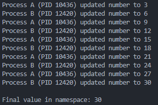
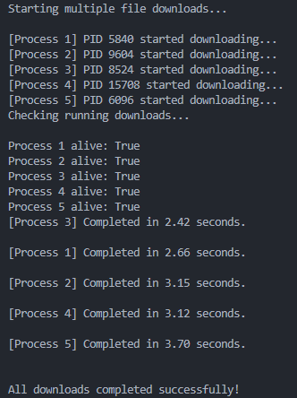

Killing Process (k_proc.py):
To forcefully stop a running program, terminate() method is used. It is commonly used to kill processes which are unresponsive. To ensure that all the resources are properly released we use join()method.

Namespace(nameSpace.py):
All process maintain their separated memory. To allow sharing of data between other processes namespace object is used which creates a shared memory environment for processes to access data to each other.

Spawning Process(spawn.py):
Spawning a process means to create a segregated execution workflow within the program. for example, in python when Multiprocessing.process is used python spawns process to run multiple tasks at a time. Each task has its own dedicated memory.

Daemon:
A process that runs in the background, which does'nt require any direct user interaction.

Background process without Daemon:
If a background process runs without Daemon it requires manual termination, if it isn't terminated the main program waits for it to be completed/ terminated to continue.

Background process with Daemon:
If a background process runs with Daemon it does not require manual termination, it terminates automatically once the thread is complete.
