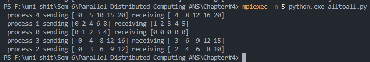
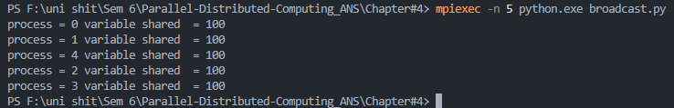
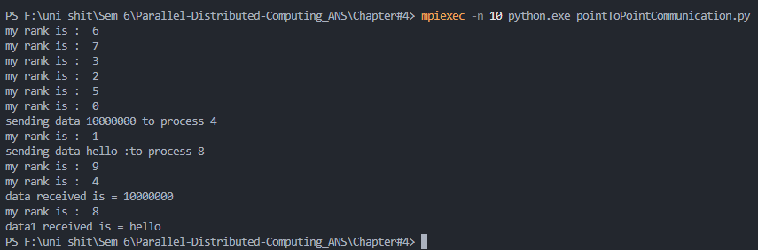
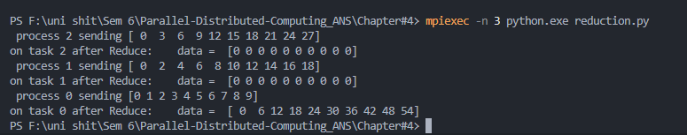
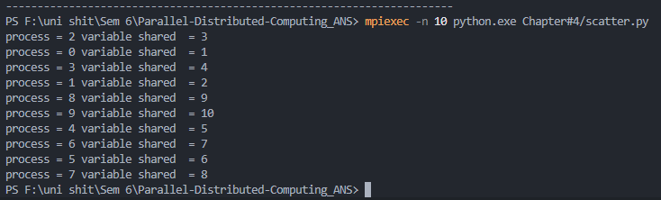
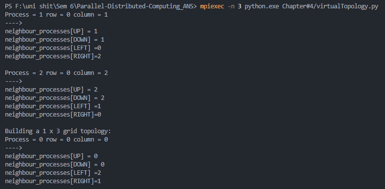
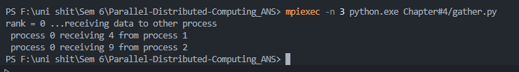
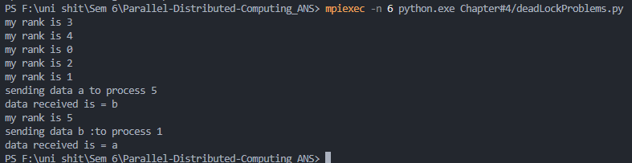

MPI:
Protocol which allows processes to communicate with each other via messages or shared memory. Mostly used where the problem can be subdivided into smaller tasks/chunks which are segregated and independent.

Below are some Methods as to which MPI passes on messages:

1.All to All (alltoall.py):
Every process sends data to and receives data from all other processes.

2.Broadcast (broadcast.py):
One process sends the same data to all other processes.

3.Point to Point (pointToPointCommunication.py):
Data is sent directly from one specific process to another.

4.Reduction (reduction.py):
Combines data from all processes using an operation (e.g., sum, max) and returns the result to one process.

5.Scatter (Scatter.py):
Distributes distinct pieces of data from one process to all other processes.

6.Virtual Topology (virtualTopology.py):
Defines a logical arrangement of processes (like grid or ring) to optimize communication.

7.Gather (gather.py):
Collects data from all processes and assembles it into one process.

8.DeadLock Problems (deadLockProblems.py):
Demonstrates how improper message ordering or synchronization can cause processes to wait indefinitely.
